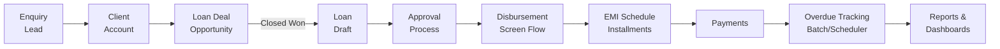
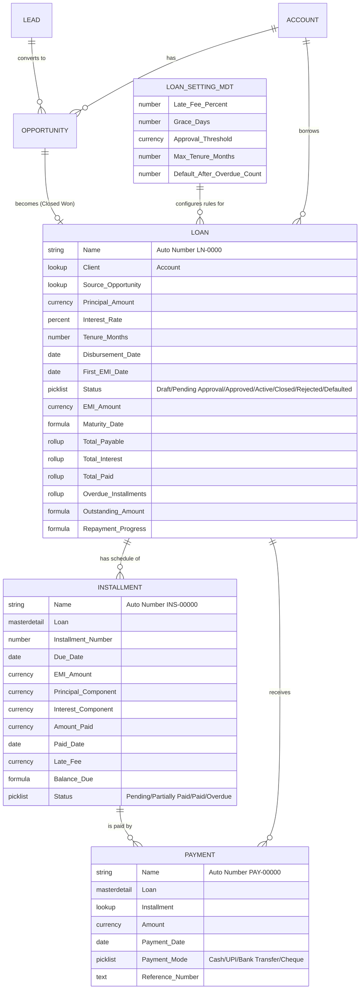

# LoanTrack — Loan & Repayment Management on Salesforce

LoanTrack is an end-to-end loan management solution built on Salesforce, covering the full lifecycle of a loan: **Enquiry → Client → Loan Deal → Loan → Approval → Disbursement → EMI Schedule → Payments → Overdue Tracking → Reports & Dashboards.**

It was built as a portfolio project to demonstrate hands-on Salesforce development skills: custom data modeling, Apex (triggers, batch, scheduled, queueable, REST), Flow automation, Lightning Web Components, integration, security, testing, and reporting.

> **Note:** This project uses dummy data only. No real client or financial data is stored in this org or repository.

---

## Table of Contents

- [Business Flow](#business-flow)
- [Architecture Overview](#architecture-overview)
- [Entity Relationship Diagram](#entity-relationship-diagram)
- [Feature List](#feature-list)
- [Tech Stack](#tech-stack)
- [Setup & Deployment](#setup--deployment)
- [Testing](#testing)
- [Screenshots](#screenshots)
- [Known Limitations & Next Steps](#known-limitations--next-steps)

---

## Business Flow



1. A **Lead** enquires about a loan (via Web-to-Lead or manual entry).
2. The Lead is converted into an **Account** (client) and an **Opportunity** (loan deal).
3. When the Opportunity is marked **Closed Won**, a Record-Triggered Flow automatically creates a **Draft Loan**.
4. The Loan goes through a two-step **Approval Process** (Manager, then Senior for large loans).
5. Once approved, the officer runs the **Disburse Loan** screen flow, which activates the loan.
6. Activating the loan triggers Apex to calculate the EMI and generate the full **Installment schedule**.
7. Clients make **Payments**, which are automatically allocated to installments (oldest due first).
8. A nightly **Batch job** marks missed installments **Overdue**, adds late fees, and marks chronically overdue loans **Defaulted**.
9. **Reports and a Dashboard** give the business a live view of the loan portfolio.

---

## Architecture Overview

```mermaid
flowchart TB
    subgraph UI["Lightning Experience"]
        LWC1[loanCalculator]
        LWC2[loanSummaryCard]
        LWC3[installmentSchedule]
        Flow1[Disburse Loan<br/>Screen Flow]
    end

    subgraph Automation["Declarative Automation"]
        ApprovalProc[Approval Process]
        ClosedWonFlow[Closed Won → Loan Flow]
        ReminderFlow[EMI Reminder<br/>Scheduled Flow]
    end

    subgraph Apex["Apex Layer"]
        LoanTrigger[LoanTrigger / Handler]
        PaymentTrigger[PaymentTrigger / Handler]
        EmiCalc[EmiCalculator]
        Batch[OverdueInstallmentBatch]
        Scheduler[OverdueScheduler]
        Queueable[AccountRollupQueueable]
        REST[LoanStatusService<br/>@RestResource]
    end

    subgraph Data["Data Model"]
        Loan[(Loan__c)]
        Installment[(Installment__c)]
        Payment[(Payment__c)]
        Account[(Account)]
    end

    subgraph External["External Systems"]
        Client[External Client<br/>via REST API]
        Webhook[webhook.site<br/>Outbound Alerts]
    end

    LWC2 -->|wire, cacheable Apex| LoanSummaryController
    LWC3 -->|imperative Apex| InstallmentScheduleController
    Flow1 --> Loan
    ClosedWonFlow --> Loan
    ApprovalProc --> Loan
    Loan --> LoanTrigger
    LoanTrigger --> EmiCalc
    LoanTrigger --> Installment
    Payment --> PaymentTrigger
    PaymentTrigger --> Installment
    PaymentTrigger --> Queueable
    Queueable --> Account
    Scheduler --> Batch
    Batch --> Installment
    Batch --> Loan
    Batch --> Queueable
    Client --> REST
    REST --> Loan
    Batch -.->|Overdue alert| Webhook
```

**Design principles followed throughout:**
- **Bulkified Apex** — every trigger handler processes collections, never single records in a loop; one SOQL query and one DML statement per method.
- **Separation of concerns** — triggers only delegate to handler classes; calculation logic (`EmiCalculator`) is isolated and reusable across triggers, LWC, and the REST API.
- **Configuration over hardcoding** — grace days, late fee %, approval threshold, and default-after-overdue-count all live in a **Custom Metadata Type**, editable by an admin without a deployment.
- **Recursion guards** on triggers to prevent duplicate processing.
- **Governor-limit awareness** — Batch Apex is used for anything that could scale to large data volumes; Queueable is used for background work that reads/writes across objects.

---

## Entity Relationship Diagram



---

## Feature List

### Data Model & Security
- Custom objects: `Loan__c`, `Installment__c` (master-detail), `Payment__c` (master-detail), and a `Loan_Setting_mdt__mdt` Custom Metadata Type for business rules.
- Standard object extensions on Lead, Opportunity, and Account.
- Private OWD on Loan with role hierarchy (Loan Manager > Loan Officer), custom Permission Sets, Field-Level Security (only managers can edit Interest Rate), and a criteria-based sharing rule sharing Defaulted loans with a Collections public group.

### Sales Cloud
- Lead Assignment Rule routing enquiries to a Loan Officers queue.
- Web-to-Lead capture form.
- Lead-to-Opportunity field mapping.
- Custom Opportunity Sales Path.
- Record-Triggered Flow that creates a Draft Loan automatically when an Opportunity is marked Closed Won.

### Core Apex (Business Logic)
- `EmiCalculator` — pure calculation class implementing the standard EMI formula, with a dedicated 0%-interest path and interview-ready rounding logic.
- `LoanTrigger` / `LoanTriggerHandler` — bulkified, recursion-guarded; generates the full installment schedule (principal/interest split, last-installment rounding correction) the moment a loan becomes Active.
- `PaymentTrigger` / `PaymentTriggerHandler` — allocates a payment across installments (oldest due first, with spill-over to the next installment), and automatically closes a loan once every installment is paid.
- Validation Rules enforcing data integrity (positive principal, rate bounds, tenure capped via Custom Metadata, locked terms once Active, no future-dated payments).

### Approval Process & Flow Automation
- Two-step Approval Process (Manager, then a Senior approver for loans above a configurable threshold).
- Screen Flow ("Disburse Loan") that captures disbursement details and activates the loan.
- Scheduled Flow that emails clients a reminder 3 days before their EMI is due.

### Asynchronous Apex
- `OverdueInstallmentBatch` (Batchable) — finds installments past their due date + grace period, marks them Overdue, applies a late fee, and defaults loans that cross an overdue-count threshold — all values sourced from Custom Metadata.
- `OverdueScheduler` (Schedulable) — runs the batch daily.
- `AccountRollupQueueable` (Queueable) — recalculates each client's Total Loans and Total Outstanding, triggered both from payments and from the nightly batch.

### Integration
- **Inbound:** `LoanStatusService`, an `@RestResource` REST endpoint (`/loanstatus/*`) returning loan status, EMI, outstanding amount, and next due date as JSON, secured via OAuth through a Connected App.
- **Outbound:** Named Credential + External Credential pointing to a test endpoint, with a callout-enabled Queueable that posts a JSON alert whenever an installment becomes Overdue.

### Lightning Web Components
- `loanCalculator` — a standalone EMI calculator on the App Home page.
- `loanSummaryCard` — outstanding amount, repayment progress bar, next due date, and overdue count, powered by `@wire` and a cacheable Apex method.
- `installmentSchedule` — a `lightning-datatable` with color-coded status badges and a "Record Payment" row action that opens a modal, creates the Payment, and refreshes the table via `refreshApex`.
- A custom Loan Record Page combining a Status Path, both components above, and related lists.

### Reports & Dashboards
- Custom Report Type: Loans with Installments and Payments.
- Reports: Loans by Status, Overdue Installments, Collections This Month, Lead Conversion Funnel.
- Loan Portfolio Dashboard (total disbursed, total outstanding, collected vs due, top overdue clients), pinned to the app Home page.

### Testing
- `TestDataFactory` for consistent, reusable test data.
- Positive, negative, and 200-record bulk tests for both triggers.
- Dedicated tests for the batch, scheduler, queueable, and REST classes, plus the LWC Apex controllers.
- **42 test methods, 100% pass rate, 86% org-wide code coverage.**

---

## Tech Stack

| Layer | Technology |
|---|---|
| Data & Automation | Custom Objects, Custom Metadata Types, Validation Rules, Flow, Approval Process |
| Apex | Triggers, Batch Apex, Schedulable, Queueable, `@RestResource` |
| Frontend | Lightning Web Components, Lightning App Builder |
| Integration | REST API (inbound), Named/External Credentials + Callouts (outbound), OAuth 2.0 |
| Security | Profiles, Permission Sets, Role Hierarchy, Sharing Rules, Field-Level Security |
| Testing | Apex unit tests (`@isTest`), `HttpCalloutMock` |
| Tooling | Salesforce CLI (`sf`), VS Code, Git/GitHub |

---

## Setup & Deployment

### Prerequisites
- A Salesforce Developer Edition org ([sign up free](https://developer.salesforce.com/signup))
- [Salesforce CLI](https://developer.salesforce.com/tools/salesforcecli) (`sf`)
- [VS Code](https://code.visualstudio.com/) with the Salesforce Extension Pack
- Git

### Steps

```bash
# 1. Clone the repository
git clone https://github.com/gowshilvijay26/loantrack-salesforce.git
cd loantrack-salesforce

# 2. Authorize your Salesforce org
sf org login web --alias loantrackerOrg --set-default

# 3. Deploy all metadata to your org
sf project deploy start --source-dir force-app

# 4. Run the full test suite and check coverage
sf apex run test --test-level RunLocalTests --result-format human --code-coverage

# 5. Load sample data (optional)
#    Use the Data Import Wizard in Setup, or an anonymous Apex script,
#    to load a handful of dummy Accounts and Loans.

# 6. Open the org
sf org open
```

### Post-deployment configuration (manual, one-time)
A few settings can't be captured in metadata and need to be set once per org:
1. **Custom Metadata values** — Setup → Custom Metadata Types → Loan Setting → Manage Records → set Grace Days, Late Fee %, Approval Threshold, Max Tenure, Default-After-Overdue-Count.
2. **Schedule the nightly batch** — Setup → Apex Classes → Schedule Apex → Class: `OverdueScheduler`, Frequency: Daily.
3. **Connected App** — create one under Setup → App Manager if you want to test the inbound REST API via OAuth.
4. **Named Credential** — point the outbound alert Queueable at your own test endpoint (e.g. a fresh [webhook.site](https://webhook.site) URL).
5. Assign the `Loan_Officer` / `Loan_Manager` permission sets to any test users you create.

---

## Testing

Run the full suite locally at any time:

```bash
sf apex run test --test-level RunLocalTests --result-format human --code-coverage
```

**Latest results:**

| Metric | Value |
|---|---|
| Tests run | 42 |
| Pass rate | 100% |
| Org-wide coverage | 86% |

---

## Screenshots

> Replace the placeholders below with real screenshots before publishing. Suggested shots: the Loan record page (Path + Loan Summary + Installment Schedule), the Approval History on a Loan, the Disburse Loan screen flow, the Installment Schedule "Record Payment" modal, and the Loan Portfolio Dashboard.

| Loan Record Page | Installment Schedule & Payment Modal |
|---|---|
|  |  |

| Approval Process in Action | Loan Portfolio Dashboard |
|---|---|
|  |  |

*(Create a `docs/screenshots/` folder in the repo and drop your PNGs in with these exact file names, or update the paths above to match your own.)*

---

## Known Limitations & Next Steps

- Payments currently only support `after insert` — editing or deleting a payment does not reverse the installment allocation. A real system would need explicit reversal logic.
- The outbound overdue alert posts to a generic test endpoint (webhook.site); in production this would point to a real downstream system with proper authentication.
- Stretch feature not yet implemented: an Interest-Only repayment type (monthly interest only, principal due at maturity).
- Jest tests cover one LWC; expanding coverage to all three components would be a natural next step.

---

## Author

Built as an end-to-end Salesforce portfolio project — data model, Apex, Flow automation, LWC, integration, security, and testing, with 86% Apex test coverage.
